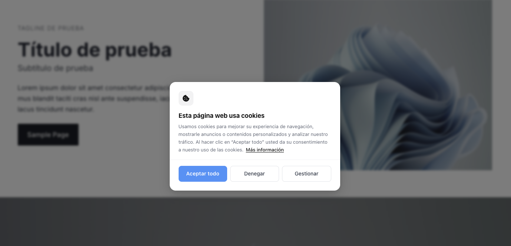
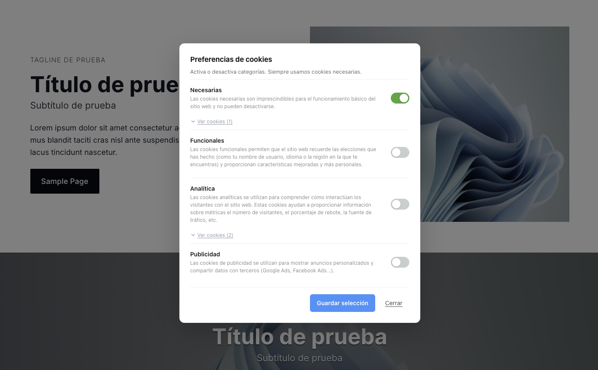
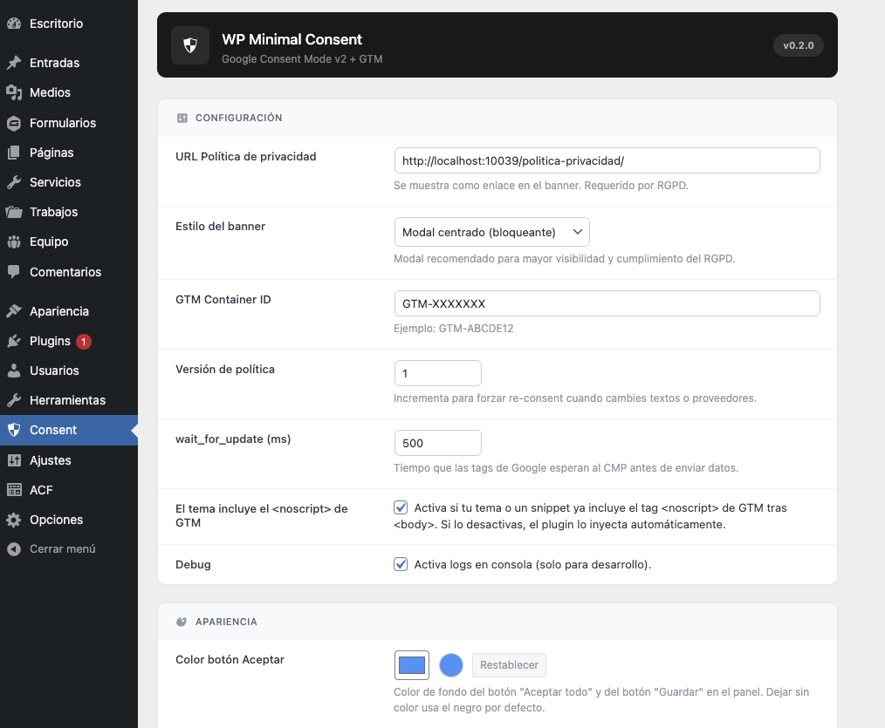

# WP Minimal Consent

**Plugin de consentimiento de cookies para WordPress**, ligero y orientado a desarrolladores, que implementa **Google Consent Mode v2** y se integra limpiamente con **Google Tag Manager (GTM)**.

> El plugin recoge el consentimiento del usuario, lo guarda en una cookie de primera parte y comunica las señales correctas a GTM. Las etiquetas y proveedores (GA4, Ads, Meta…) se gestionan en GTM, no en el plugin.



## ¿Qué hace exactamente?

1. Antes de cargar GTM, establece todos los permisos en `denied` (Advanced Mode)
2. Carga GTM siempre — las etiquetas se bloquean solas hasta recibir consentimiento
3. Muestra un banner al usuario (barra inferior o modal bloqueante)
4. Cuando el usuario decide, guarda la elección en una **cookie de primera parte** y actualiza GTM via `gtag('consent', 'update', {...})`

## Características

### Banner y panel de preferencias

- Dos estilos: **barra inferior** (discreta) o **modal centrado** (bloqueante)
- Cuatro categorías de consentimiento: Necesarias, Funcionales, Analítica, Publicidad
- Las cookies necesarias aparecen con un toggle bloqueado (no se pueden desactivar)
- Lista de cookies desplegable por categoría (nombre, finalidad, duración, tipo)
- Botón flotante para reabrir preferencias en cualquier momento
- Diseño responsive — se adapta a móvil

<br>



### Integración con GTM y Consent Mode v2

- Implementa **Advanced Mode**: defaults en `denied` antes de que cargue GTM
- Señales gestionadas: `analytics_storage`, `ad_storage`, `ad_user_data`, `ad_personalization`
- `wait_for_update` configurable para evitar que las etiquetas disparen demasiado rápido
- Emite el evento `wpmc_consent_update` al `dataLayer` cuando el usuario cambia su elección
- Inyección opcional del tag `<noscript>` de GTM (o delega en el tema)

### Panel de administración

- Menú propio en el sidebar de WordPress: **Consent → Ajustes**
- Configuración visual organizada en tarjetas
- Colores personalizables: botón Aceptar y fondo del banner
- Textos del banner y del panel editables sin tocar código
- Lista de cookies pre-rellena con valores típicos de GA4 y Google Ads

<br>



### Técnico

- Sin dependencias externas (ni jQuery, ni librerías de terceros)
- Cookie de primera parte con atributos `Secure`, `SameSite=Lax`
- API JavaScript para integraciones avanzadas
- Bloqueo opcional de scripts externos no gestionados por GTM
- Desinstalación limpia: elimina `wpmc_options` de la base de datos

## Requisitos

- WordPress 5.9+
- PHP 7.4+
- Google Tag Manager (contenedor Web) configurado correctamente

## Instalación

1. Copia la carpeta `wp-minimal-consent` en `wp-content/plugins/`
2. Activa el plugin en **WP → Plugins**
3. Ve a **Consent → Ajustes** en el menú lateral del administrador
4. Introduce tu **GTM Container ID** (ejemplo: `GTM-ABCDE12`)
5. Añade la URL de tu **política de privacidad**
6. Elige el estilo del banner y ajusta los textos si lo necesitas

## Flujo de funcionamiento

```
<head>
  ↓ gtag('consent', 'default', { todo: 'denied' })   ← plugin
  ↓ GTM carga                                        ← plugin
  ↓ Tags en GTM quedan bloqueados                    ← GTM

<body>
  ↓ Banner visible al usuario                        ← plugin

El usuario acepta/rechaza
  ↓ Cookie de primera parte guardada                 ← plugin
  ↓ gtag('consent', 'update', {...})                 ← plugin
  ↓ dataLayer.push({ event: 'wpmc_consent_update' }) ← plugin
  ↓ GTM decide qué tags disparar                     ← GTM
```

## API JavaScript

El plugin expone una API mínima accesible desde `window`:

```js
// Leer el consentimiento actual (devuelve objeto o null)
window.RcConsent.getConsent();

// Guardar consentimiento manualmente
window.RcConsent.setConsent({
  necessary: true,
  analytics: true,
  ads: false,
  functional: false,
});

// Comprobar si una categoría está permitida
window.RcConsent.hasConsent("analytics"); // → true / false

// Versión simplificada (recomendada en código custom)
window.wpmcCanRun("analytics"); // → true / false
window.wpmcCanRun("ads");
window.wpmcCanRun("functional");
window.wpmcCanRun("necessary");
```

## Bloquear scripts fuera de GTM

Si tienes scripts de terceros que no pasan por GTM (por ejemplo, un pixel cargado directamente en el tema), puedes registrarlos con el filtro `wpmc_providers`. El plugin los imprimirá bloqueados y los activará cuando el usuario dé su consentimiento:

```php
add_filter( 'wpmc_providers', function ( $providers ) {
  $providers['mi_proveedor'] = array(
    'category' => 'analytics',  // 'analytics' | 'ads' | 'functional'
    'type'     => 'script',
    'src'      => 'https://ejemplo.com/script.js',
    'attrs'    => array( 'async' => true ),
  );
  return $providers;
} );
```

## Configuración de GTM

Ver guía detallada: [gtm_instructions.md](gtm_instructions.md)

Incluye cómo configurar Consent Overview, variables de estado, triggers para etiquetas no-Google (Clarity, Meta, TikTok…) y errores comunes.

## Cumplimiento GDPR

- Denegación por defecto para todos los visitantes
- Consentimiento explícito requerido antes de cualquier tracking
- Separación clara de finalidades (analítica / publicidad / funcional)
- Sin almacenamiento server-side del consentimiento individual
- Arquitectura alineada con Google Consent Mode v2 y recomendaciones del EDPB

> El cumplimiento legal final depende también del contenido jurídico del sitio (política de privacidad, cookies) y de la configuración correcta de GTM.

## Changelog

### 0.2.0

- Panel de administración rediseñado con layout de tarjetas y menú propio
- Estilo modal añadido (bloqueante, con overlay difuminado)
- Categoría funcional añadida al banner y al panel
- Lista de cookies desplegable por categoría
- Valores por defecto pre-rellenos para GA4 y Google Ads
- Colores personalizables para botón y fondo del banner
- Tag `<noscript>` de GTM inyectable desde el plugin (con toggle)
- Toggle de cookies necesarias bloqueado visualmente
- Desinstalación limpia con `uninstall.php`
- Mejoras de accesibilidad: gestión de foco, ARIA, teclado

### 0.1.1

- Versión inicial
- Consent Mode v2 con defaults en `denied`
- Banner de barra + panel de preferencias (Analítica / Publicidad)
- Página de ajustes básica
